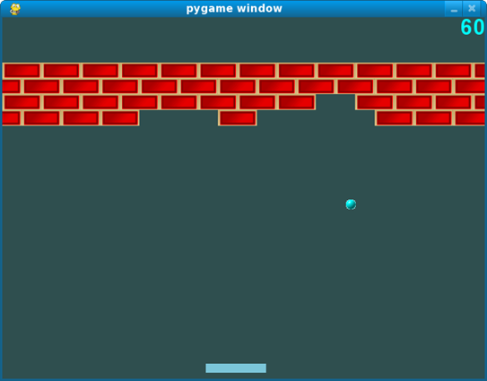

[](https://classroom.github.com/a/NJj3NOqn)
# **SWE4-Übungen - SS2025 - Übung 1**

## **Breakout (`src/breakout`)**

Breakout ist ein absoluter Klassiker unter den Videospielen, der Mitte der
Siebzigerjahre von Atari entwickelt wurde. Das zugrundeliegende Spielkonzept ist
ganz einfach. Der Spielende hat die Kontrolle über einen Schläger, mit dem er
versuchen muss, einen Ball so lange wie möglich im Spiel zu halten. Mit dem Ball
kann er Ziegel aus einer Mauer schießen. Für jeden abgeschossenen Ball bekommt
er Punkte gutgeschrieben. Die Wertigkeit der Ziegel kann unterschiedlich sein.
Mit Fortdauer des Spiels steigert sich der Schwierigkeitsgrad, da die
Geschwindigkeit des Balls zunimmt.

<div align="center">
  
</div>

1. Ihre Aufgabe ist es nun, unter *möglichst weitreichendem Einsatz* der STL
   einen einfachen Breakout-Klon zu entwickeln, der zumindest folgende Anforderungen erfüllt: 

    *	Der Spielende kann den Schläger mit Tastatur und/oder Maus bewegen. 

    *	Der Austrittswinkel des Balls hängt von seinem Eintrittswinkel und der
    Position, an dem der Ball den Schläger berührt hat, ab. 

    *	Die Mauer besteht aus mehreren Reihen von Ziegeln. Die Wertigkeit der Ziegel
    (wie viele Punkte der Spielende für das Abschießen des Ziegels bekommt) wird
    dargestellt (farbkodiert oder in Form einer Beschriftung).

    *	Der aktuelle Spielstand wird angezeigt und laufend aktualisiert. 

    *	Verschieden Konfigurationsparameter (initiale Ballgeschwindigkeit, Größe des
    Schlägers, Parameter, die den Aufbau der Mauer beschreiben etc.) werden in einer
    Datei gespeichert und werden beim Starten des Spiels eingelesen.

    Implementieren Sie das Spiel auf Basis der Grafikbibliothek [*Simple and fast
    Multimedia Library (SFML)*](https://www.sfml-dev.org/documentation/3.0.0/).
    Dieses Repository enthält ein einfaches Beispielprogramm (im Ordner
    `src/intro`), das die grundsätzliche Funktionsweise dieser Bibliothek demonstriert.

    Die für die Verwendung von *SFML* notwendigen Bibliotheken können Sie
    [hier](https://fhooe-my.sharepoint.com/:u:/g/personal/p20058_fhooe_at/ETo5O1NcHodKoWVBweh2MGsBc7L-GfQuh9DOoO1U4io4ow?e=ZbCxDz)
    herunterladen. Packen Sie diese Archiv-Datei aus und kopieren Sie die darin
    enthaltenen Dateien in den Ordner `vcpkg`. Beachten Sie, dass dieser Ordner
    - genauso wie der Ordner `build` - auf keinen Fall eingecheckt werden darf.

    Die Verzeichnisstruktur sollte folgendermaßen
    aussehen:
      ```
      |--src/
      |  |--intro/
      |  |  |--src/
      |  |  |--resources/
      |  |--breakout/
      |  |  |--src/
      |  |  |--resources/
      |--vcpkg
      |--CMakeLists.txt
      |--CMakeSettings.json
      |--run-cmake.bat
      ```
    
    Sie können das Projekt entweder direkt über das Kontextmenü in Visual Studio
    öffnen (*Open a local folder*) oder mit `run-cmake.bat` eine
    Visual-Studio-Solution erzeugen und diese anschließend öffnen.
    
    Falls Sie in Ihrer Implementierung Ressourcen (Fonts, Images u. dgl.) benötigen,
    kopieren Sie diese in den Ordner `src/breakout/resources`. `CMakeLists.txt`
    enthält ein Kommando, das die Dateien in diesem Verzeichnis in das
    Binärverzeichnis kopiert, sodass die Ressourcen bei der Ausführung des Programms
    zur Verfügung stehen.

2. Sorgen Sie durch Einsatz einer geeigneten STL-basierten Datenstruktur dafür,
   dass die Kollisionserkennung zwischen Ball und Ziegeln möglichst effizient
   erfolgen kann. Es sollte gewährleistet sein, dass die sich in der Nähe des
   Balls befindlichen Ziegel schnell identifiziert werden können und nur für
   diese der Kollisionscheck durchgeführt werden muss.

Sie dürfen bei der Realisierung des Spiels Ihrer Fantasie freien Lauf
lassen und können es optional mit zusätzlicher Funktionalität und
Spezialeffekten anreichern. Hier nur einige Anregungen dazu:

* Statt nur Farben zu verwenden, können Sie Ziegel auch mit Texturen belegen.
* Fügen Sie Soundeffekte hinzu, die beim Treffen des Balls auf Ziegel, beim
  Abprallen des Balls vom Schläger oder bei der Zerstörung von Ziegeln
  abgespielt werden.
* Implementieren Sie mehrere Level mit unterschiedlichem Schwierigkeitsgrad.
