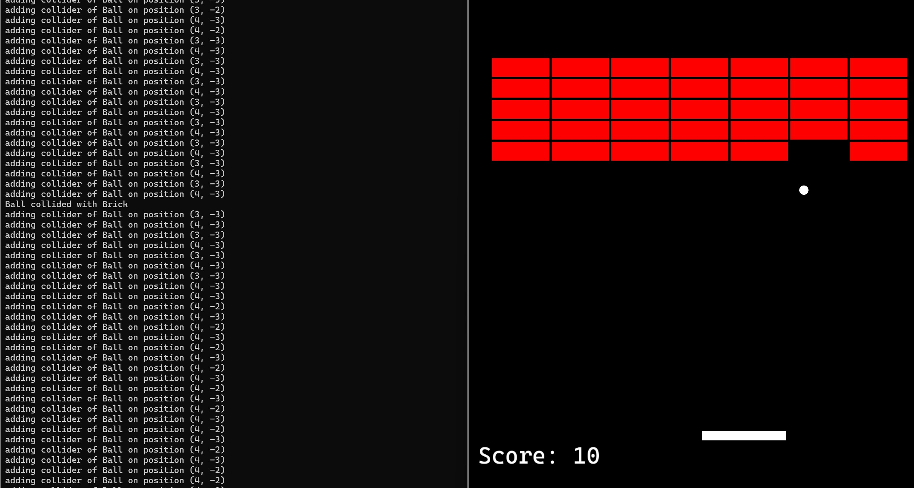
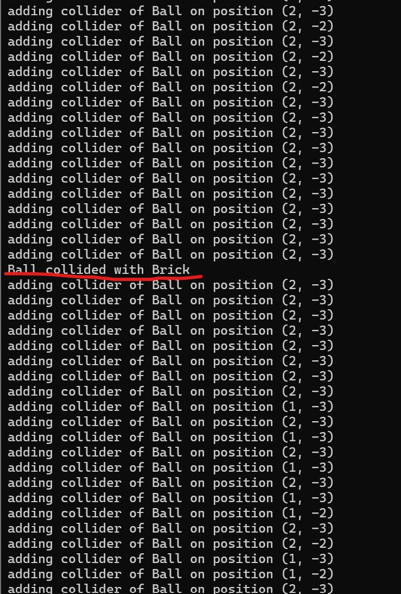
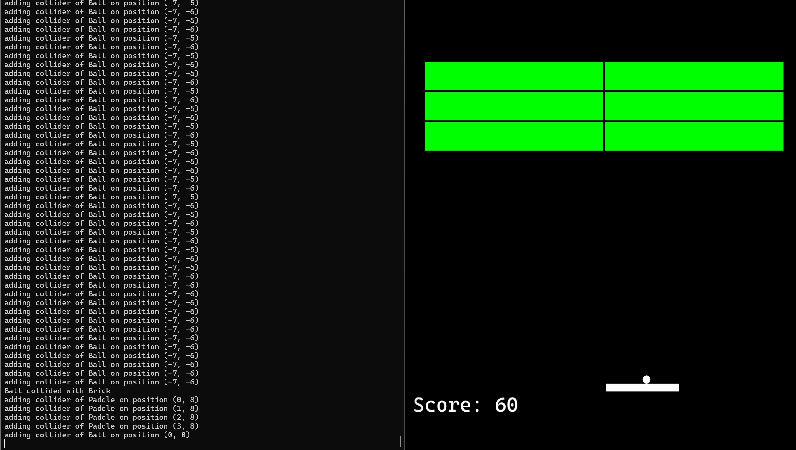
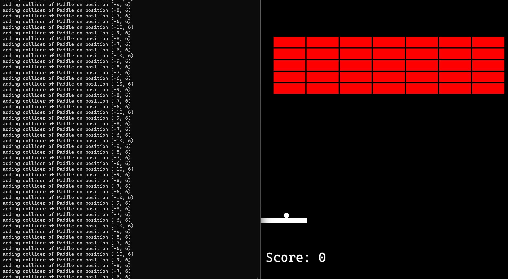
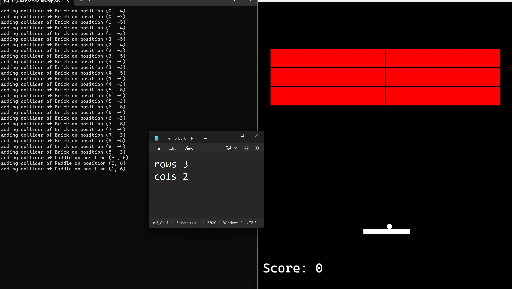
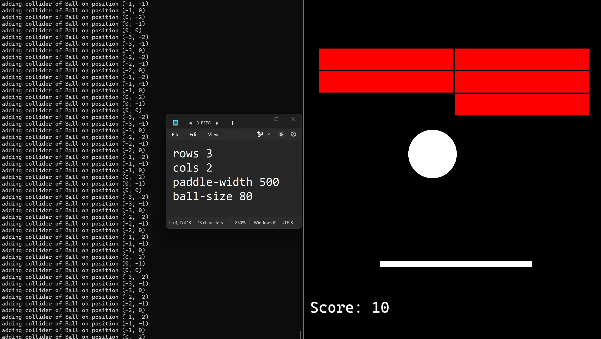
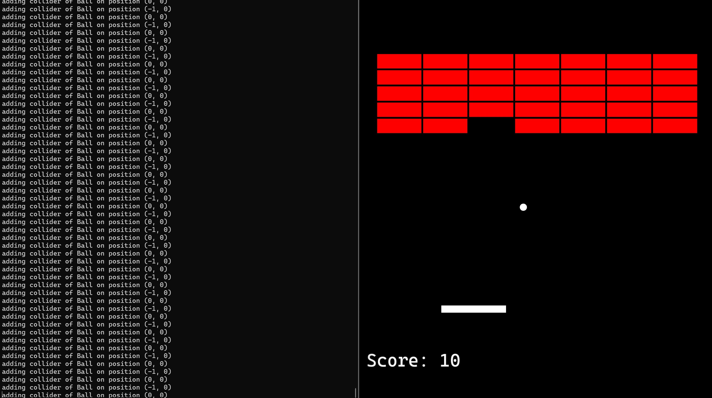
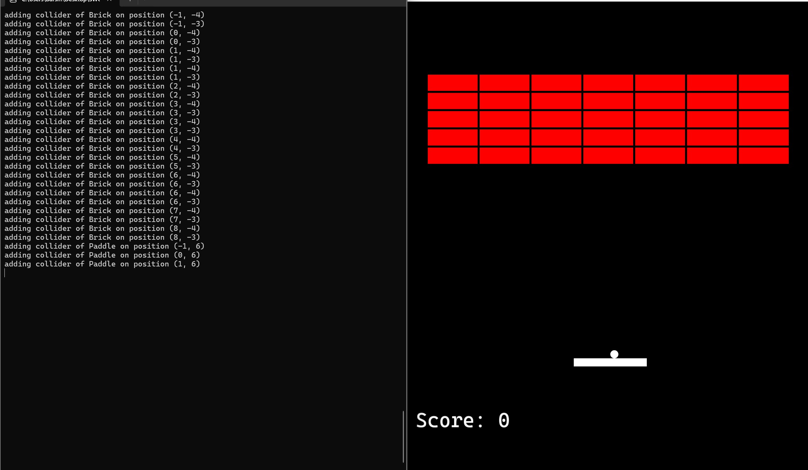

# **Übung 1 - Ausarbeitung**

### **Lösungsidee**

#### **1. Basisarchitektur des Projekts**
Das Breakout-Spiel ist modular aufgebaut und setzt sich aus mehreren Kernkomponenten zusammen, die eine einfache Erweiterbarkeit und Wartbarkeit ermöglichen:

- **GameEngine**: Zentrale Steuerung des Spiels, Verwaltung von Objekten und Engines.
- **SimpleGameObject**: Grundklasse für alle Spielobjekte, integriert Transformation, Rendering und Event-Handling.
- **Event-System**: Ermöglicht die flexible Kommunikation zwischen Objekten ohne direkte Abhängigkeiten.
- **Engines (Physics, Collision, Controller)**: Trennen verschiedene logische Aspekte des Spiels (Physik, Kollisionen, Steuerung).
- **Spielobjekte (Ball, Paddle, Brick)**: Spezifische Implementierung von Spiellogik und Verhalten.
- **Beobachter (Observer)**: Überwachung bestimmter Ereignisse, wie das Zerstören von Blöcken oder das Fallen des Balls.

#### **2. Event-System & SimpleGameObject**
Das **Event-System** basiert auf dem **Observer-Pattern** und sorgt für eine lose Kopplung zwischen Objekten. Die zentrale Event-Handling-Klasse ist `IEventListener`, die eine **unordered_multimap** für Event-Handler speichert.

##### **Event-Handling Mechanismus:**
1. `registerEventHandler<T>(...)` registriert eine Methode für ein spezifisches Event.
2. `handleEvent(...)` ruft alle passenden Handler für das empfangene Event auf.

Die Klasse **SimpleGameObject** ist eine Basisklasse für alle Spielobjekte und enthält:
- Transformationsfunktionen (Position, Rotation, Skalierung)
- Rendering-Funktionalität
- Eine **RigidBody**-Komponente für Bewegung
- Eine **Collider**-Komponente für Kollisionsprüfungen
- Event-Handling-Unterstützung

Dadurch können verschiedene Spielobjekte (z. B. `Brick`, `Paddle`, `Ball`) leicht erweiterte Funktionalitäten hinzufügen.

#### **3. Engines zur Spiellogik**
Engines kapseln verschiedene Spielmechaniken und werden von der **GameEngine** verwaltet.

- **SimplePhysicsEngine**: Berechnet Bewegungen anhand der Geschwindigkeit der Objekte.
- **SimpleCollisionEngine**: Organisiert Objekte in einem Gitter zur effizienten Kollisionsprüfung.
- **Controller**: Wandelt Tasteneingaben in Bewegungen um und sendet Events an das Paddle.
- **Beobachter (Observers)**:
  - `BrickDestructionObserver`: Überwacht zerstörte Blöcke und informiert den `GameManager`.
  - `BallFallObserver`: Setzt das Spiel zurück, falls der Ball aus dem Spielbereich fällt.
  - `GameStartObserver`: Startet das Spiel nach einer bestimmten Eingabe.

#### **4. Kollisionsdetektion in der `CollisionEngine`**
Die `SimpleCollisionEngine` nutzt eine **Gitterbasierte Spatial-Partitioning-Technik** zur effizienten Kollisionsprüfung. Dies reduziert die Anzahl unnötiger Berechnungen, indem Objekte nur mit anderen in ihrer Umgebung geprüft werden.

##### **Umsetzung:**
- Die **Spielwelt** wird in ein **Grid mit Zellen (`GridCell`)** unterteilt.
- Eine **`std::unordered_map<int, std::unordered_map<int, GridCell>>`** speichert Objekte nach ihrer **Gitterposition**.
- Jedes Objekt wird basierend auf seiner Position in eine oder mehrere benachbarte `GridCell`-Einträge eingefügt.
- Bei der Kollisionsprüfung werden nur die Objekte innerhalb der **gleichen oder angrenzenden Zellen** geprüft.

##### **Algorithmus zur Kollisionsprüfung:**
1. **Objekte einsortieren:** Jedes Objekt wird in die entsprechende `GridCell`-Map anhand seiner Position einsortiert.
2. **Relevante Nachbarn finden:** Beim Bewegen eines Objekts werden nur Nachbarzellen betrachtet.
3. **Bounding Box Kollisionstest:** Es wird eine AABB-Kollision (Axis-Aligned Bounding Box) mit Objekten in den relevanten Zellen durchgeführt.
4. **Event-Dispatch:** Falls eine Kollision erkannt wird, wird ein `CollisionEvent` generiert und an die betroffenen Objekte gesendet.

Diese Technik sorgt dafür, dass das Spiel auch bei vielen Objekten effizient läuft, da **unnötige Vergleiche vermieden werden**.

#### **5. Implementierung der Spielobjekte**
##### **Paddle (Schläger)**
- Besitzt eine Geschwindigkeit.
- Reagiert auf **Steuerungs-Events** (links/rechts Bewegung).
- Wird von **WallCollisionEvents** beeinflusst, um im Bildschirmbereich zu bleiben.

##### **Ball**
- Enthält Geschwindigkeit und Winkel.
- Reagiert auf **CollisionEvents** mit Wänden, Paddle und Blöcken.
- Reflektiert sich anhand der Kollisionsnormale.

##### **Brick (Ziegelstein)**
- Hat eine Kollisionserkennung.
- Reagiert auf **CollisionEvents** und zerstört sich selbst.

#### **6. Ablauf des Programms**
1. **Spielstart**: `GameEngine` initialisiert das Spielfenster und erstellt Spielobjekte.
2. **Objektverwaltung**: `GameManager` verwaltet Ball, Paddle und Blöcke.
3. **Ereignisse verarbeiten**: Controller und Engines senden Events an Spielobjekte.
4. **Physik-Update**: `SimplePhysicsEngine` bewegt Objekte anhand ihrer Geschwindigkeit.
5. **Kollisionserkennung**: `SimpleCollisionEngine` identifiziert Kollisionen und sendet Events.
6. **Rendering**: `GameEngine` zeichnet alle sichtbaren Objekte.
7. **Spiel beenden**: Falls der Ball fällt oder alle Blöcke zerstört wurden, wird das Spiel zurückgesetzt oder ein neues Level gestartet.

---

Diese Architektur ermöglicht eine **einfache Erweiterbarkeit**, da neue Events, Spielobjekte oder Mechaniken eingefügt werden können, ohne den bestehenden Code stark zu verändern.

#### STEUERUNG
- **Pfeiltasten** oder **WASD**: Bewegen des Schlägers
- **Leertaste**: Starten des Spiels

### **Testfälle**

#### **1. Kollisionserkennung-1**

##### **Beschreibung:**
- Der Ball kollidiert mit dem Ziegelstein.
- Der Ziegelstein wird zerstört.
- Der Ball wird reflektiert.

#### **2. Kollisionserkennung-2**

##### **Beschreibung:**
- Mittels einer **Gitterbasierte Spatial-Partitioning-Technik** wird die Kollisionserkennung effizient durchgeführt.
- Der Ball kollidiert mit dem Ziegelstein.
- Es wird ein Event ausgelöst.
- Event wird von den betroffenen Objekten verarbeitet.

#### **3. Neues Level**

##### **Beschreibung:**
- Nachdem alle Ziegelsteine zerstört wurden, wird ein neues Level gestartet.
- Es wird eine neue Farbe für die Ziegelsteine verwendet.
- Der Ball wird zurückgesetzt.
- Der Spieler kann das Spiel fortsetzen.
- Es werden mehr Punkte für das Zerstören von Ziegelsteinen vergeben.
- Das Spiel wird herausfordernder.(Der Ball bewegt sich schneller)

### **4. Bewegung des Schlägers**

##### **Beschreibung:**
- Der Schläger bewegt sich nach links.
- Es werden die betroffenen GridCells aktualisiert.
- Der Schläger bleibt innerhalb des Spielbereichs.

### **5. Das Spiel konfigurieren**

##### **Beschreibung:**
- Die Spalten- und Zeilenanzahl der Ziegelsteine wird auf 2 und 3 geändert.
- Alle andere Parameter bleiben "by default" - definiert.

### **6. Das Spiel konfigurieren-2**

##### **Beschreibung:**
- Es wird zusätzlich die Schlägerbreite und Kugelgröße geändert.

### **8. Bewegung des Balls**

##### **Beschreibung:**
- Der Ball bewegt sich im Spielbereich.
- Es werden die betroffenen GridCells aktualisiert.

### **9. Spielstart/restart**

##### **Beschreibung:**
- Das Spiel wird initialisiert.
- Der Ball und der Schläger werden erstellt und entsprechend positioniert.
- Die Ziegelsteine werden generiert und richtig platziert.
- Die betrofennen GridCells werden aktualisiert.

### **10. Spielprozess**

- Im ./doc Verzeichnis findet man eine Test-Gameplay.mp4 Datei, die den Spielprozess zeigt.