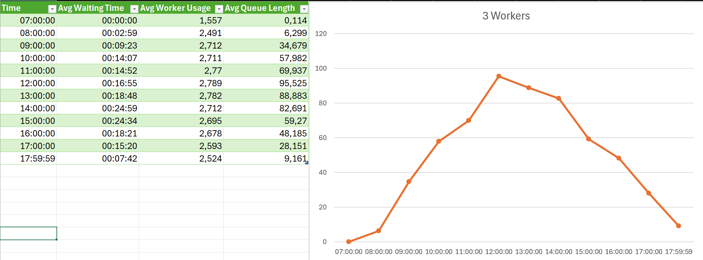
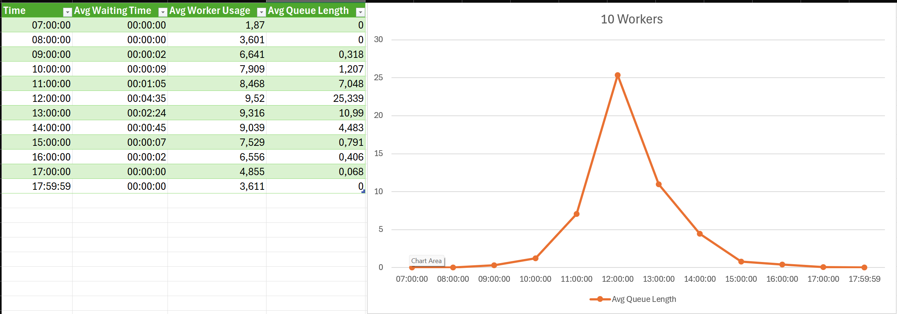
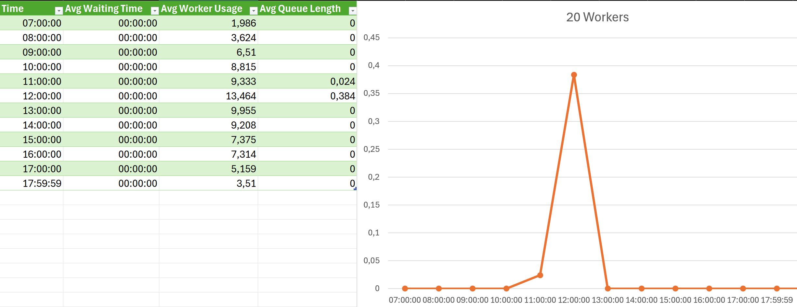
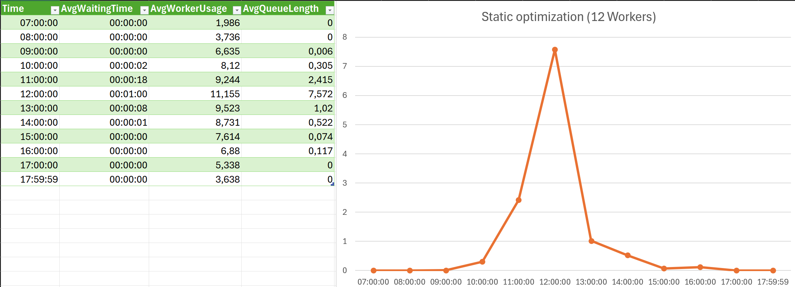
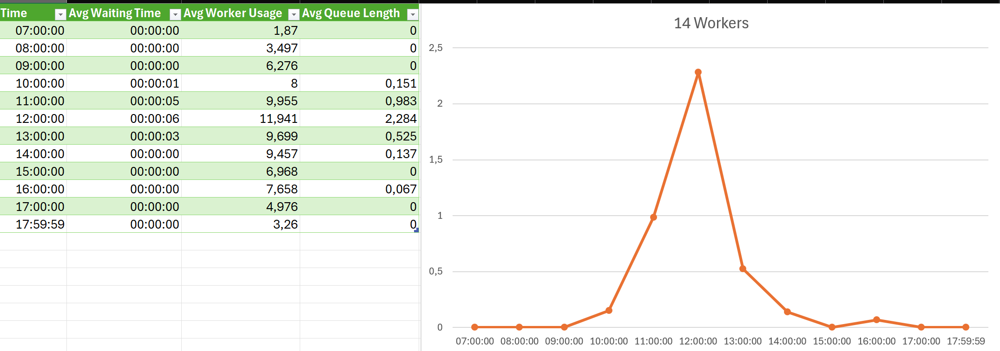
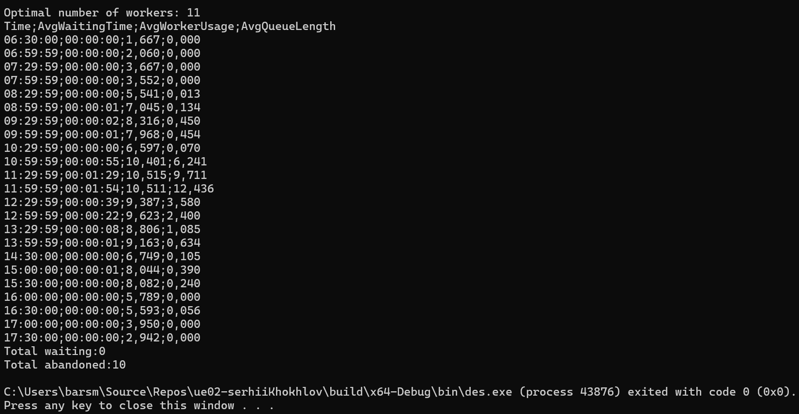
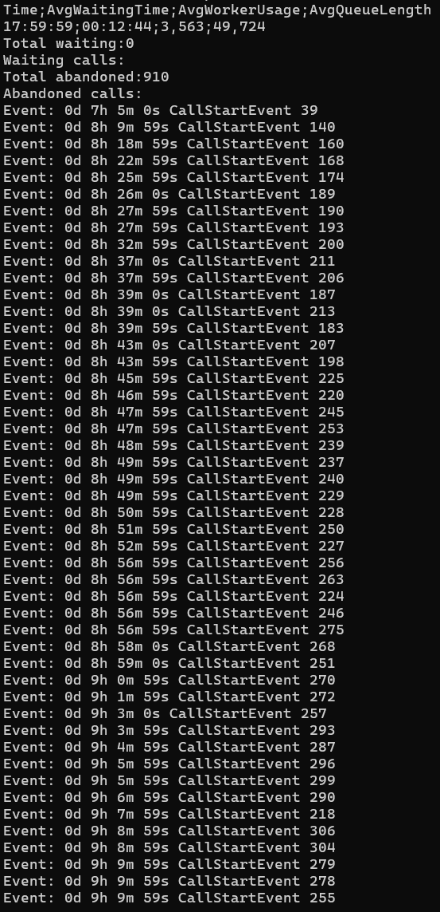

# **Übung 2 - Ausarbeitung**

## **Beispiel 1**

### **Lösungsidee**

#### Architektur der Simulationsbibliothek

##### 1. **DESSimulator (Basisklasse)**

Das Herzstück des Simulators bildet die abstrakte Klasse `DESSimulator`. Sie verwaltet die zentrale Ereigniswarteschlange (`priority_queue<Event>`), führt die Simulation durch (`run()` / `step()`), steuert das Ressourcen-Management (`ResourcePool`) und sammelt Metriken.  

Events werden chronologisch abgearbeitet. Jedes Event kann bei Ausführung optional ein Folgeereignis erzeugen (`makeNextEvent()`), welches wieder in die Warteschlange eingereiht wird.  

> 💡 Neue Ereignistypen können leicht durch Vererbung von `Event` implementiert werden.

---

##### 2. **Event-System**

Das polymorphe Ereignissystem basiert auf der abstrakten Klasse `Event`. Sie definiert die Grundstruktur aller Ereignisse und unterstützt Vergleichbarkeit zur Priorisierung in der Queue.  
Wichtige spezialisierte Events:
- **`CallStartEvent`**: Startet einen Anruf (prüft Ressourcen, erzeugt ggf. `CallEndEvent`).
- **`CallEndEvent`**: Gibt belegte Ressourcen wieder frei.
- **`StopEvent`**: Beendet die Simulation.
- **`MetricsCheckEvent`**: Erfasst in regelmäßigen Intervallen Auswertungsmetriken.

---

##### 3. **ResourcePool**

Dieses Modul verwaltet die Kapazität des Call-Centers (z. B. verfügbare Mitarbeiter). Es erlaubt Ressourcen zu reservieren (`acquire`) und wieder freizugeben (`release`).  

Der aktuelle Auslastungsgrad und die Verfügbarkeit können jederzeit abgefragt werden.

---

#### Anwendungsszenario: Call-Center-Simulation

Das Call-Center verarbeitet eingehende Anrufe, deren Auftreten sich anhand einer exponentialverteilten Interarrival-Zeit richtet. Die Anrufrate variiert stündlich über den Tag und wird über ein `std::array<int, 24>` modelliert.  

##### Anrufverarbeitung:

1. **Ein Anruf kommt an** (`CallStartEvent`)
   - Ist ein Mitarbeiter frei?  
     → Ja: Call wird gestartet und `CallEndEvent` geplant.  
     → Nein: Call wird in die Warteschlange gestellt und ein Zeitlimit zum Aufgeben (log-normal verteilt) gesetzt.
2. **Ende eines Anrufs** (`CallEndEvent`)  
   - Mitarbeiter wird freigegeben.
   - Warteschlange wird verarbeitet: warten Anrufer, wird nächster Call gestartet.
3. **Abbruch eines Anrufs**  
   - Wenn Wartezeit das gegebene Limit überschreitet, wird der Call als abgebrochen markiert.

---

#### Metriken und Simulation

Alle 60 Minuten wird ein `MetricsCheckEvent` ausgelöst. Dabei werden folgende Kennzahlen gespeichert:
- Durchschnittliche Wartezeit
- Mitarbeiterauslastung
- Warteschlangenlänge

Diese werden in eine CSV-Datei ausgegeben (`metrics.csv`) und können grafisch dargestellt werden.

---

#### Hauptprogramm

Im `main()` werden folgende Schritte ausgeführt:

1. **Initialisierung der Anrufrate pro Stunde**
2. **Optimierung der Mitarbeiteranzahl**
   - Ein einfacher Optimierungsalgorithmus bestimmt die minimal notwendige Mitarbeiteranzahl anhand von Zielgrößen:  
     - Wartezeit < 30 Sek.  
     - Warteschlangenlänge < 10
3. **Start der Simulation mit optimierter Konfiguration**
4. **Speichern der Metriken und Auswertung der Ergebnisse**

---

#### Erweiterbarkeit

Die Bibliothek wurde modular entworfen und lässt sich leicht anpassen:
- Neue Ereignistypen lassen sich durch Vererbung von `Event` integrieren.
- Dynamische Anpassung der Ressourcenverfügbarkeit pro Stunde wäre durch geplante `ResourceChangeEvent`s möglich.

---

### **Testfälle**

#### 1. 3 Mitarbeiter
Hier ist sehr übersichtlich, dass die Simulation nicht optimal läuft und dass die Warteschlange enorm lang ist.

#### 2. 10 Mitarbeiter
Hier ist die Simulation schon besser, aber die Warteschlange ist immer noch etwas lang.

#### 3. 20 Mitarbeiter
Die Simulation läuft hier sehr gut, die Warteschlange ist sehr kurz und die Auslastung der Mitarbeiter könnte aber etwas mehr optimal sein.

#### 4. 12 Mitarbeiter (automatisch-optimiert)
Obwohl die Simulation mit 12 Mitarbeitern um einiges "langsamer" als mit 20 ist, ist sie trotzdem besser, weil die Warteschlange immer noch sehr kurz ist und die Auslastung der Mitarbeiter hier am besten optimiert wird.

#### 5. 14 Mitarbeiter

#### 6. 30 Minuten Intervall fürs `MetricsCheckEvent` und automatische Optimierung
Hier wird auch zur Ausgabe in die Konsole umgeschaltet.

#### 7. Einmal `MetricsCheckEvent` und 4 Mitarbeiter mit extra Ausgabe
Hier wird auch zur Ausgabe in die Konsole umgeschaltet und es wird übersichtlich jetzt, wie viele Calls abgebrochen werden mussten.

In XML-Datei kann man auch die zusätzlichen Diagrammen zum Vergleich finden.

