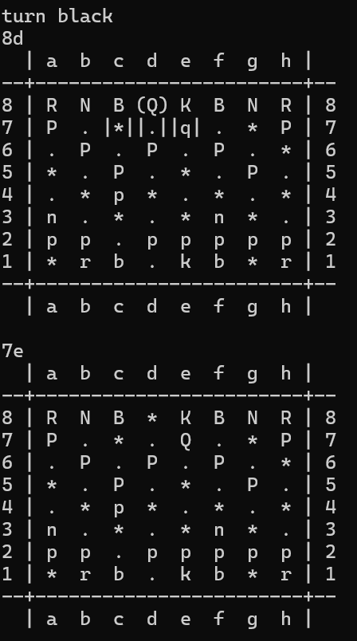

# **SWO3-Übungen - WS2024/25 - Übungszettel 7 - Ausarbeitung**

## **Beispiel 1**

### **Lösungsidee**

#### Wichtige Klassen und Strukturen

##### **`position`**
Repräsentiert eine 2D-Koordinate auf dem Schachbrett:
- **Attribute**: `x` (Spalte), `y` (Zeile).
- Überladene Operatoren `==` und `!=`, um Positionen zu vergleichen.

##### **`color`** und **`figure`** Enums
- `color`: Definiert das Team (`white`, `black`).
- `figure`: Repräsentiert die Arten von Schachfiguren (`king`, `queen`, etc.) mittels Zeichen.

##### **`chess_cell`**
Repräsentiert ein einzelnes Feld auf dem Schachbrett:
- **Attribute**:
  - `clr`: Feldfarbe.
  - `cm`: Zeiger auf eine `chessman`, die das Feld belegt.
  - `pos`: Position des Feldes.
  - Flags: `selected`, `highlighted`.
- **Wichtige Methoden**:
  - `set_chessman`: Weist eine Schachfigur dem Feld zu.
  - `select` / `deselect`: Markiert das Feld als ausgewählt.
  - `highlight`: Hebt das Feld für spezielle Zwecke hervor (z. B. aktive Figur).
  - `get_pos`: Gibt die Position des Feldes zurück.

##### **`chessman`** (Abstrakte Basisklasse)
Repräsentiert eine beliebige Schachfigur:
- **Attribute**:
  - `clr`: Farbe der Figur.
  - `repr`: Figurenrepräsentation (`king_f`, `pawn_f`, etc.).
  - `essential`: Gibt an, ob die Figur essenziell ist (z. B. der König).
  - `cur_cell`: Zeiger auf die aktuelle `chess_cell`.
  - `selected_cells`: Vektor mit möglichen Zielfeldern.
- **Wichtige Methoden**:
  - Abstrakte Methoden: `select_fields` und `can_be_moved_to` (von abgeleiteten Klassen implementiert).
  - `select` / `deselect`: Verwalten die Hervorhebung der Bewegungen.
  - `get_selected_cells`: Zugriff auf potenzielle Züge.
  - Überladener `<<`-Operator für die Ausgabe.

##### **Spezialisierte Figurenklassen**
Spezialisierungen der Klasse `chessman` für jeden Figurentyp (`king`, `queen`, etc.):
- Implementieren `select_fields`, um mögliche Züge basierend auf den Schachregeln zu berechnen.
- Implementieren `can_be_moved_to`, um spezifische Züge zu validieren.
- Beispiele:
  - **`king`**: Bewegt sich auf angrenzende Felder.
  - **`queen`**: Kombiniert die Bewegungen von Turm und Läufer.
  - **`knight`**: L-förmige Bewegung.

---

#### Kernspielmechanik

##### **Initialisierung des Schachbretts**
Die Funktion `initialize_board` richtet ein 8x8-Schachbrett ein:
- Wechselnde Farben der Felder.
- Platziert die Figuren in ihrer Anfangsaufstellung.

##### **Spielschleife (Hauptprogramm)**
Das Spiel läuft, bis der König einer Seite gefangen wird:
1. **Eingabeparsing**: Interpretiert Spielereingaben für das Auswählen/Bewegen von Figuren.
2. **Auswahl und Bewegung**:
   - `select`: Hebt gültige Züge einer ausgewählten Figur hervor.
   - `move_to`: Bewegt die Figur, wenn das Ziel gültig ist.
3. **Wechsel der Spielzüge**: Abwechselnd weiß und schwarz.

##### **Zugausführung**
- **Validierung**: Verwendet `can_be_moved_to`, um die Legalität zu überprüfen.
- **Schlagen**: Wenn das Zielfeld eine gegnerische Figur enthält, wird diese entfernt.
- **Erster Zug**: Verfolgt bei Bauern, ob ein Zwei-Felder-Zug noch möglich ist.

##### **Automatischer Spielmodus**
Das Programm unterstützt einen automatischen Spielmodus, der durch die Eingabe der Option `-a` oder `--auto` aktiviert wird. In diesem Modus:
1. **Automatische Figurenwahl**: Die Funktion `auto_select` wählt zufällig eine spielbare Figur aus.
2. **Automatische Bewegung**: Die Funktion `auto_move` bewegt die ausgewählte Figur auf ein zufällig gewähltes gültiges Zielfeld.
3. **Spielablauf**: Das Spiel wird ohne Benutzereingaben gespielt, bis eine Seite verliert.
4. **Visualisierung**: Nach jedem Zug wird das Schachbrett aktualisiert und ausgegeben.

Dieser Modus eignet sich für das Testen der Spiellogik oder zum Beobachten von Partien zwischen den beiden Teams.

##### **Ausgabe**
Die Funktion `print_board` zeigt das Schachbrett an:
- Hebt ausgewählte Felder und aktive Figuren hervor.
- Unterscheidet die Hintergrundfarben der Felder.

---

#### Interaktion der Klassen

1. **Schachbrett und Figuren**:
   - `chess_cell` verwaltet Zeiger auf `chessman`-Objekte.
   - Bewegungen beinhalten die Aktualisierung des `cur_cell`-Zeigers einer Figur und ihres zugehörigen Feldes.

2. **Figurenspezifische Logik**:
   - Abgeleitete `chessman`-Klassen übernehmen die Validierung von Zügen und die Hervorhebung der Auswahl.
   - Figuren "wählen" Felder dynamisch basierend auf dem Zustand des Schachbretts aus.

3. **Spielzustandsverwaltung**:
   - Die Variablen `game_status` und `turn` halten den aktuellen Zustand und die Zugreihenfolge aufrecht.

---

#### Wichtige Methoden und Datenfluss

1. **`select`**:
   - Markiert eine Figur und deren gültige Züge mit `select_fields`.
   - Stellt sicher, dass nur Figuren der aktuellen Farbe ausgewählt werden können.

2. **`move_to`**:
   - Validiert das Ziel.
   - Aktualisiert das Schachbrett und den Zustand der Figur.
   - Schlagen gegnerischer Figuren und Wechseln der Züge.

3. **`print_board`**:
   - Gibt das Schachbrett aus, unter Verwendung der `<<`-Operatoren für `chessman` und `chess_cell`.

4. **Dynamische Speicherverwaltung**:
   - Figuren werden während der Brettinitialisierung dynamisch alloziert.
   - Speicherbereinigung erfolgt in `delete_board`.

---

Diese Implementierung kapselt Schachregeln und -mechaniken in gut definierten Klassen und sorgt für Modularität und Flexibilität. Zukünftige Erweiterungen (z. B. Rochade, En Passant, Schach-Erkennung) können durch Erweiterung der bestehenden Architektur hinzugefügt werden.

### **Testfälle**

#### **Test1**
Start des Spiels (im Auto-Modus) und das Bewegen vom Springer.

#### **Test2**
Das Bewegen vom Bauer.

#### **Test3**
Das Bewegen vom Turm.

#### **Test4**
Das Bewegen der Königin.

#### **Test5**
Das Bewegen der Königin.

#### **Test6**
Das Bewegen und Schlagen mit der Königin.

#### **Test7**
Königin VS Königin.

#### **Test8**
Das Bewegen des Königs.

#### **Test9**
Das Ende des Spiels.

